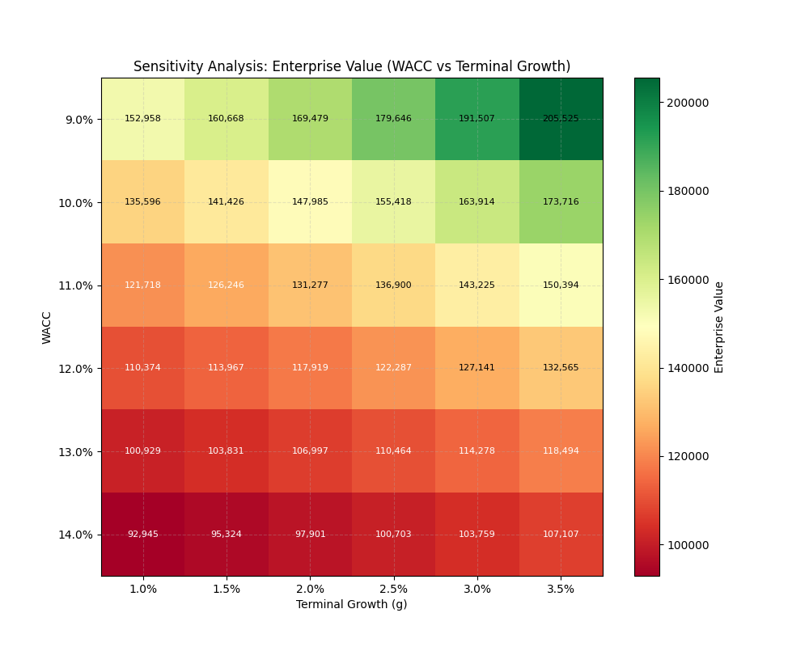
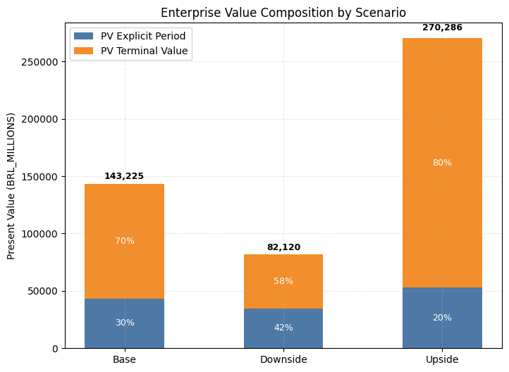
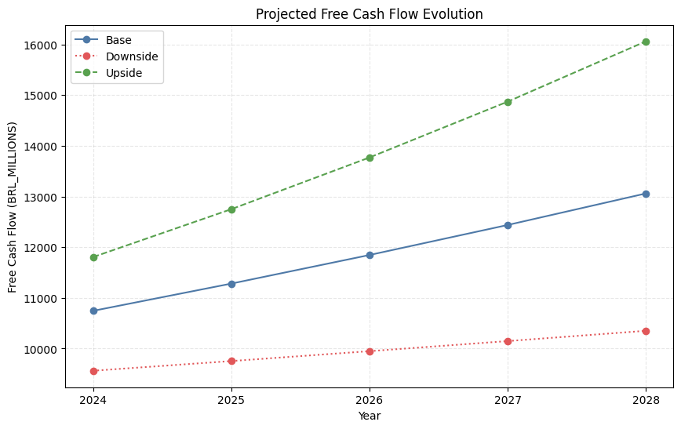
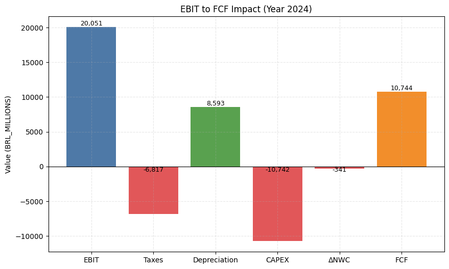

# Finance Valuation Pipeline
Automated Discounted Cash Flow (DCF) valuation from financial statements.

## Overview

This project implements a simplified valuation pipeline in Python. It processes historical financial data, projects future cash flows based on configurable scenarios, and calculates Enterprise Value using the Discounted Cash Flow (DCF) method. It is designed for educational purposes to demonstrate structural modeling logic and sensitivity analysis, rather than for professional equity research.

## Deliverables

The pipeline automatically generates the following outputs in the `outputs/` directory:

- **summary.json**: Detailed valuation report including Enterprise Value, Equity Value, and model assumptions for Base, Downside, and Upside scenarios.
- **projections.csv**: Year-by-year financial forecast (Revenue, EBIT, NOPAT, CAPEX, FCF).
- **sensitivity_ev.csv**: Matrix of Enterprise Values across varying WACC and Terminal Growth rates.
- **plots/**: Visualizations of key valuation drivers.

## Example Outputs

### Sensitivity Analysis

Impact of WACC and Terminal Growth Rate on Enterprise Value.

### Enterprise Value Composition

Breakdown of value between the explicit forecast period and the terminal value.

### Free Cash Flow Projection

Projected Free Cash Flow trajectory across different scenarios.

### EBIT to FCF Bridge

Waterfall chart illustrating the conversion of operational profit into free cash flow (Year 1).

## How to Run

1. **Create a virtual environment**:
   ```bash
   python -m venv venv
   # Windows:
   .\venv\Scripts\activate
   # Mac/Linux:
   source venv/bin/activate
   ```

2. **Install dependencies**:
   ```bash
   pip install pandas numpy matplotlib pydantic
   ```

3. **Execute the pipeline**:
   ```bash
   python run.py
   ```

## Project Structure

```text
finance-valuation/
├── run.py                 # Main execution entry point
├── config.py              # Scenario configurations and assumptions
├── data/                  # Input CSV files (Balance Sheet, Income Statement, Cash Flow)
├── outputs/               # Generated reports, data, and plots
├── src/                   # Source code
│   ├── finance/           # Core valuation logic (DCF, metrics, projections)
│   ├── io/                # Data loading and validation
│   ├── pipeline/          # Orchestration logic
│   └── reporting/         # Exporting results and plotting
└── tests/                 # Unit tests
```

## Assumptions and Limitations

- **Simplified Data**: The model uses consolidated annual data and simplified working capital logic.
- **Explicit Assumptions**: Revenue growth, margins, and capital structure are driven by explicit inputs in `config.py`.
- **Focus**: The priority is code structure, reproducibility, and sensitivity testing, not absolute valuation precision.

## Disclaimer

This project is for educational purposes only and does not constitute financial advice or investment recommendation.
